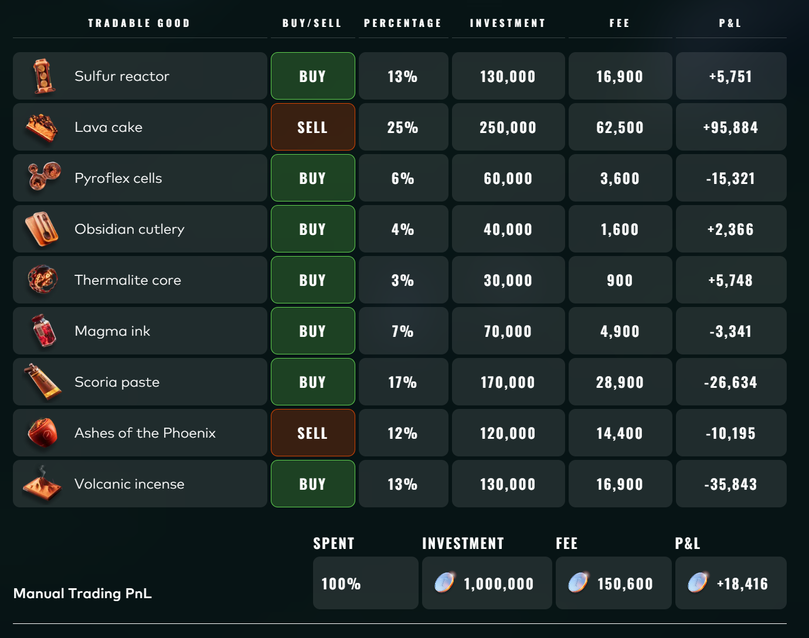

# IMC Prosperity 4 Postmortem

Our team achieved **Global Rank 31** in **IMC Prosperity 4**.

This repository is a compact writeup of our strategies, observations, and manual challenge decisions.

---

## Structure

```text
.
├── README.md
├── final_submission.py
└── figures/
```

---

## Tools

We mainly used three tools during the competition:

### Local backtesting

We used local backtests to quickly compare parameter choices and discard clearly bad ideas.  
The most useful checks were PnL stability, position usage, and whether the strategy depended on a few lucky trades.

### Plotting scripts

For each new product, we first plotted prices, moving averages, correlations, and lagged correlations.  
Most of our final ideas came from visual inspection before coding the actual strategy.

### Prosperity visualizer

The visualizer was especially useful for reading order book structure and checking bot trades.


---

# Algorithm Challenge

## Round 1 / Round 2: ASH and ROOT

Products:

- `INTARIAN_PEPPER_ROOT`
- `ASH_COATED_OSMIUM`

### INTARIAN_PEPPER_ROOT

`INTARIAN_PEPPER_ROOT` showed a very strong upward drift.

**Final strategy:** buy to the position limit at the beginning and hold.

The only nontrivial part was execution. Buying the full position too aggressively could sweep multiple ask levels, so we still had to account for slippage.


### ASH_COATED_OSMIUM

`ASH_COATED_OSMIUM` had a large spread, so it was suitable for market making.

**Baseline strategy:** quote inside the spread.

```text
bid = best_bid + 1
ask = best_ask - 1
```


The key extra observation was that one side of the order book sometimes disappeared.  
When this happened, we placed more aggressive quotes to exploit the temporary lack of liquidity.


---

## Round 3 / Round 4: HYDROGEL, VELVET, and Options

Products:

- `VELVETFRUIT_EXTRACT`
- `HYDROGEL_PACK`
- VELVET options

### Initial option attempt

Options were introduced in this round. Our first idea was to compute implied volatility with Black-Scholes and look for a volatility smile.

This did not work well. The fitted IV curve was not stable enough to produce a reliable trading rule.



In Round 3, we had no strong option strategy, so we mostly used passive quoting. The result was weak.

### VELVETFRUIT_EXTRACT

After inspecting the data, we found that a longer-horizon mean-reversion strategy worked better than our early short-EMA version.

The Round 3 mean-reversion attempt failed mostly because the EMA parameters were poorly chosen. After tuning the horizon, the strategy improved significantly.


We also noticed that the market seemed to contain a double-layer market maker plus noisier retail-like orders.  
For fair value estimation, filtering out the noisy outer orders worked better than directly using the raw best bid / best ask.

### Options

In Round 4, we stopped treating the options as pure volatility products. Most options moved almost like leveraged versions of the underlying `VELVETFRUIT_EXTRACT`.

**Final idea:** first trade VELVET correctly, then use selected options as leveraged exposure to the same signal.

### HYDROGEL_PACK

We did not find a very strong standalone signal for `HYDROGEL_PACK`.

**Final strategy:** market making plus EMA mean reversion.

---

## Round 5: Large Product Universe

Round 5 had many products, so the main problem was prioritization.


### Fast filtering

We first tested simple market making on all products.  
If a product was already profitable with market making, we kept it simple and moved on.

### Correlation and lag search

For the remaining products, we searched for correlated pairs and lead-lag relationships.

**Strategy:** buy the relatively cheap product and sell the relatively expensive related product.

For some pairs, a lagged correlation was stronger than the same-time correlation, so we used the leading product to predict the lagging one.


### Abnormal straight-line products

Some products occasionally entered a special state where the price became almost a straight line and jumped by around 100 each time.

We added special-case code to detect and trade this regime separately instead of applying the normal market-making logic.


---

# Manual Challenge

## Round 1

This round was small enough to brute force.

**Strategy:** enumerate possible choices and take the best result.

---

## Round 2

Once speed was fixed, the other two parameters had a unique best response.  
The main decision was the speed value.

If everyone chose `0`, that would be a Nash equilibrium due to the tie-breaking rule.  
We expected many players to choose `1`, so we also chose:

```text
speed = 1
```

---

## Round 3

We modeled the game as choosing a number from `0` to `50`.

The goal was to stay close to the median, with asymmetric penalties.  
Ignoring player behavior, the optimal choice was around `33`.

We ran a small survey-like experiment to estimate what people would choose, but it did not generalize well.  
We chose around `39`; the actual best choice seemed to be around `34` or `35`.


---

## Round 4

We optimized mainly for expected value and ignored risk.

This was a mistake. The result was a large loss.

---

## Round 5

We selected a portfolio of buy/sell positions based on expected profitability, fees, and allocation size.


---

# Summary

Main profitable ideas:

- ROOT: buy and hold the strong upward drift.
- ASH: market make inside the wide spread and exploit missing order-book sides.
- VELVET: longer-horizon mean reversion.
- Options: use selected options as leveraged exposure to VELVET.
- Round 5: combine quick market-making filters, correlation search, lag search, and special regime handling.

Main mistakes:

- Trying to force unstable IV-smile analysis in Round 3.
- Poor EMA parameter choice in early VELVET experiments.
- Trusting correlation too quickly in Round 5.
- Ignoring risk in Manual Round 4.
