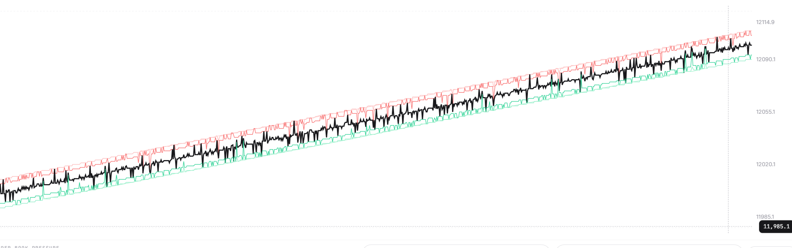
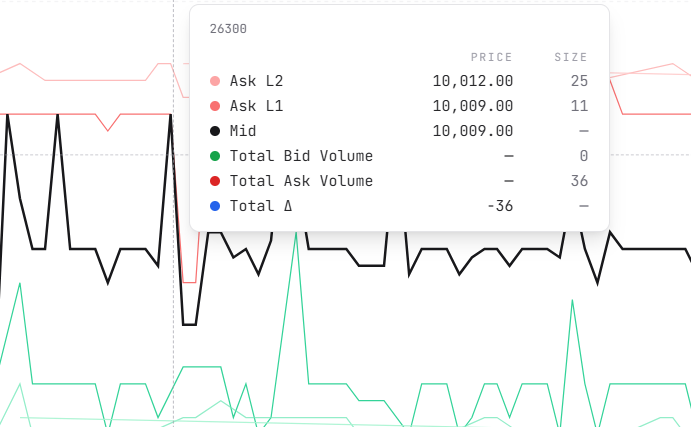
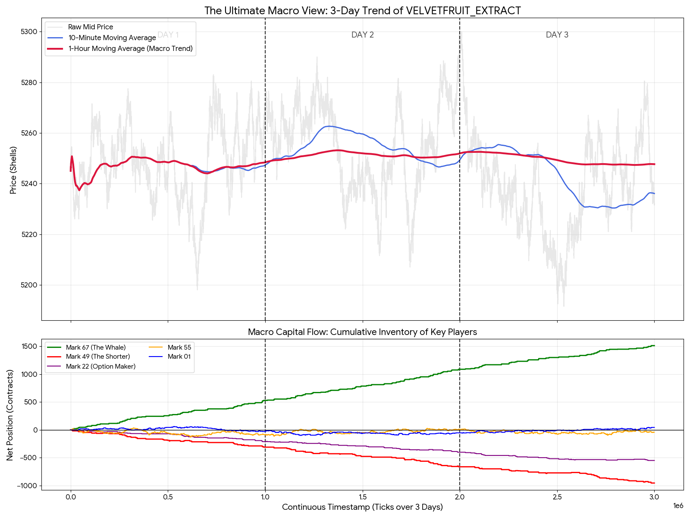
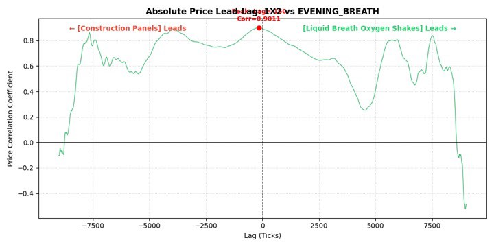
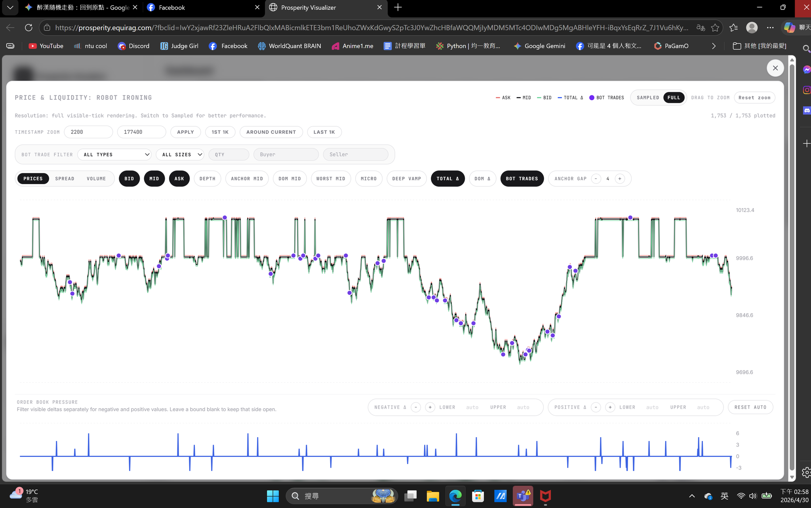

# IMC Prosperity 4 review

Our team achieved **Global Rank 31** in **IMC Prosperity 4**.

This repository is a compact writeup of our algorithmic and manual trading strategies.

---

## Structure

```text
.
├── README.md
├── final_submission.py
└── figures/
```

---

## Tools

### Local backtesting

We used local backtests to compare parameter choices and discard clearly bad ideas.  
The most useful checks were PnL stability, position usage, and whether a strategy depended on a few lucky trades.

### Plotting scripts

For each new product, we first plotted prices, moving averages, correlations, and lagged correlations.  
Most of our final ideas came from visual inspection before coding the actual strategy.

### Prosperity visualizer

The visualizer was useful for reading order book structure and checking bot trades.


---

# Algorithm Challenge

## Round 1 / Round 2: ASH and ROOT

Products:

- `INTARIAN_PEPPER_ROOT`
- `ASH_COATED_OSMIUM`

### INTARIAN_PEPPER_ROOT

`INTARIAN_PEPPER_ROOT` showed a very strong upward drift.

**Final strategy:** buy to the position limit at the beginning and hold.

The only nontrivial part was execution. Buying the full position too aggressively could sweep multiple ask levels, so we still had to account for slippage.



### ASH_COATED_OSMIUM

`ASH_COATED_OSMIUM` had a large spread, so it was suitable for market making.

**Baseline strategy:** quote inside the spread.

```text
bid = best_bid + 1
ask = best_ask - 1
```


The key extra observation was that one side of the order book sometimes disappeared.  
When this happened, we placed more aggressive quotes to exploit the temporary lack of liquidity.



---

## Round 3 / Round 4: HYDROGEL, VELVET, and Options

Products:

- `VELVETFRUIT_EXTRACT`
- `HYDROGEL_PACK`
- VELVET options

### Initial option attempt

Options were introduced in this round. Our first idea was to compute implied volatility with Black-Scholes and look for a volatility smile.

This did not work well. The fitted IV curve was not stable enough to produce a reliable trading rule.


In Round 3, we had no strong option strategy, so we mostly used passive quoting The result was weak.

### VELVETFRUIT_EXTRACT

After inspecting the data, we found that a longer-horizon mean-reversion strategy worked better than our early short-EMA version.

The Round 3 mean-reversion attempt failed mostly because the EMA parameters were poorly chosen. After tuning the horizon, the strategy improved significantly.



We also noticed that the market seemed to contain a double-layer market maker plus noisier retail-like orders.  
For fair value estimation, filtering out the noisy outer orders worked better than directly using the raw best bid / best ask.

### Options

In Round 4, we stopped treating the options as pure volatility products. Most options moved almost like leveraged versions of the underlying `VELVETFRUIT_EXTRACT`.

**Final idea:** first trade VELVET correctly, then use selected options as leveraged exposure to the same signal.

### HYDROGEL_PACK

We did not find a very strong standalone signal for `HYDROGEL_PACK`.

**Final strategy:** market making plus EMA mean reversion.

---

## Round 5: Large Product Universe

Round 5 had many products, so the main problem was prioritization.


### Fast filtering

We first tested simple market making and EMA mean reverse on all products.  
If a product was already profitable with market making or mean reverse, we kept it simple and moved on.

### Correlation and lag search

For the remaining products, we searched for correlated pairs and lead-lag relationships.

**Strategy:** buy the relatively cheap product and sell the relatively expensive related product.

For some pairs, a lagged correlation was stronger than the same-time correlation, so we used the leading product to predict the lagging one.



### Abnormal straight-line products

Some products occasionally entered a special state where the price became almost a straight line and jumped by around 100 each time.

We added special-case code to detect and trade this regime separately instead of applying the normal market-making logic.



---

# Manual Challenge

## Round 1: Walrasian Auction

### Rules

The first manual challenge was a sealed opening auction for two products:

- `DRYLAND_FLAX`
- `EMBER_MUSHROOM`

For each product, we submitted one limit order with a price and quantity.  
After all orders were submitted, the exchange chose a single clearing price that maximized traded volume. If multiple prices produced the same maximum volume, the higher price was chosen.

After the auction, inventory was settled at fixed merchant prices:

```text
DRYLAND_FLAX     settlement price = 30
EMBER_MUSHROOM   settlement price = 20, with 0.10 fee per unit traded
```

### Solver

The brute force is straightforward. For every possible submitted price and quantity, simulate the auction, compute the clearing price, compute our filled quantity, and then compute settlement PnL.

The scoring function used in the solver was:

```text
PnL = filled_quantity * (settlement_price - clearing_price - fee)
```

where `fee = 0` for `DRYLAND_FLAX` and `fee = 0.10` for `EMBER_MUSHROOM`.

### Brute-force skeleton

```python
def clearing_price_after_order(book_buys, book_sells, my_side, my_price, my_qty):
    buys = book_buys.copy()
    sells = book_sells.copy()

    if my_side == "BUY":
        buys.append((my_price, my_qty, "ME"))
    else:
        sells.append((my_price, my_qty, "ME"))

    candidate_prices = sorted(set(p for p, _, _ in buys + sells))
    best_price = None
    best_volume = -1

    for p in candidate_prices:
        demand = sum(q for price, q, _ in buys if price >= p)
        supply = sum(q for price, q, _ in sells if price <= p)
        volume = min(demand, supply)

        # tie-break: higher clearing price
        if volume > best_volume or (volume == best_volume and (best_price is None or p > best_price)):
            best_volume = volume
            best_price = p

    return best_price, best_volume


def eval_order(book_buys, book_sells, side, price, qty, settlement, fee=0.0):
    clearing, total_volume = clearing_price_after_order(book_buys, book_sells, side, price, qty)

    # Writeup-level simplification:
    # the final solver also handles price-time priority for partial fills at the clearing price.
    if side == "BUY":
        filled = qty if price >= clearing else 0
        pnl = filled * (settlement - clearing - fee)
    else:
        filled = qty if price <= clearing else 0
        pnl = filled * (clearing - settlement - fee)

    return pnl, clearing, filled


def brute_force(book_buys, book_sells, side, prices, quantities, settlement, fee=0.0):
    best = None

    for price in prices:
        for qty in quantities:
            pnl, clearing, filled = eval_order(
                book_buys, book_sells, side, price, qty, settlement, fee
            )
            candidate = (pnl, price, qty, clearing, filled)
            if best is None or candidate[0] > best[0]:
                best = candidate

    return best
```

We used this to brute-force the two auctions and then cross-checked the answer by manually inspecting the order book.

---

## Round 2: Invest & Expand

### Rules

Round 2 was an allocation problem with a fixed budget of `50,000` XIRECs.  
We had to allocate percentages to three components:

```text
Research + Scale + Speed <= 100
```

The payoff model was:

```text
net_pnl = research_value * scale_value * speed_multiplier - budget_used
```

with

```text
research_value(x) = 200000 * ln(1 + x) / ln(101)
scale_value(x)    = 7 * x / 100
budget_used       = 50000 * (research + scale + speed) / 100
```

`Speed` was the game-theoretic part. It did not directly enter as a smooth function; instead, it determined a rank-based multiplier. Higher speed gave a better multiplier, but if many teams chose the same speed, the tie rule changed the effective payoff.

### Optimizing Research and Scale for fixed Speed

For a fixed speed allocation `v`, the remaining budget is

```text
B = 100 - v
```

We use the full remaining budget between Research and Scale because both increase gross PnL and the budget penalty is already linear.

So:

```text
scale = B - research
```

For a fixed speed multiplier `m`, the optimization becomes:

```text
maximize:
    200000 * ln(1 + r) / ln(101) * 7 * (B - r) / 100 * m
    - 50000 * (r + (B-r) + v) / 100
```

Since `r + (B-r) + v = 100`, the budget cost is constant after fixing speed and using the whole budget.

So we only need to maximize:

```text
f(r) = ln(1 + r) * (B - r)
```

The first-order condition is:

```text
(B - r) / (1 + r) = ln(1 + r)
```

This gives a unique optimum for Research, and then Scale is determined by:

```text
scale = B - research
```

### Example: if Speed = 1

If we choose:

```text
speed = 1
```

then:

```text
B = 99
```

Solving

```text
(99 - r) / (1 + r) = ln(1 + r)
```

gives approximately:

```text
research ≈ 22.95
scale    ≈ 76.05
speed    = 1
```

This is why, once speed was chosen, the other two parameters were essentially determined by a one-dimensional optimization.

### Code used for the one-dimensional search

```python
import math

def research_value(x):
    return 200000 * math.log(1 + x) / math.log(101)

def scale_value(x):
    return 7 * x / 100

def net_pnl(research, scale, speed, speed_multiplier):
    budget_used = 50000 * (research + scale + speed) / 100
    gross = research_value(research) * scale_value(scale) * speed_multiplier
    return gross - budget_used

def optimize_research_scale(speed, speed_multiplier=0.5, step=0.01):
    B = 100 - speed
    best = None

    n = int(B / step)
    for i in range(n + 1):
        research = i * step
        scale = B - research
        pnl = net_pnl(research, scale, speed, speed_multiplier)
        candidate = (pnl, research, scale, speed)
        if best is None or candidate[0] > best[0]:
            best = candidate

    return best

print(optimize_research_scale(speed=1, speed_multiplier=0.5))
```

### Speed decision

The actual hard part was choosing `Speed`.

If everyone chose `0`, the tie rule could make `0` a Nash-like equilibrium.  
However, we expected many teams to think that choosing `1` would slightly beat the crowd choosing `0`. If too many teams did this, then choosing `0` could lose its advantage.

Our final choice was therefore:

```text
speed = 1
research ≈ 23
scale ≈ 76
```

The exact Research / Scale values were rounded for submission.

---

## Round 3: Celestial Gardeners' Guild

### Rules

This manual round involved buying `Ornamental Bio-Pods` from a hidden number of counterparties.

Each counterparty had a reserve price uniformly distributed over:

```text
670, 675, 680, ..., 920
```

We could submit two bids, `b1` and `b2`.

* If `b1` was higher than a counterparty's reserve price, we traded at `b1`.
* Otherwise, if `b2` was higher than the reserve price, we could trade at `b2`.
* If `b2` was not higher than the average second bid of all players, the PnL from the second bid was multiplied by the penalty

$$
\left(\frac{920 - \text{avg_b2}}{920 - b2}\right)^3.
$$

All acquired Bio-Pods were then sold the next day at fair value `920`.

### Model

For a fixed estimate of `avg_b2`, the expected value can be computed by brute force over the reserve prices.

For one reserve price `r`, the payoff is:

```text
if b1 > r:
    payoff = 920 - b1
elif b2 > r:
    payoff = (920 - b2) * penalty
else:
    payoff = 0
```

where

```text
penalty = 1, if b2 > avg_b2
penalty = ((920 - avg_b2) / (920 - b2))^3, otherwise
```

The code skeleton was:

```python
RESERVES = list(range(670, 921, 5))

def penalty(b2, avg_b2):
    if b2 > avg_b2:
        return 1.0
    return ((920 - avg_b2) / (920 - b2)) ** 3

def ev_for_fixed_average(b1, b2, avg_b2):
    p = penalty(b2, avg_b2)
    total = 0.0

    for r in RESERVES:
        if b1 > r:
            total += 920 - b1
        elif b2 > r:
            total += (920 - b2) * p

    return total / len(RESERVES)

def brute_force(avg_b2):
    best = None

    for b1 in range(670, 921, 5):
        for b2 in range(b1, 921, 5):
            value = ev_for_fixed_average(b1, b2, avg_b2)
            candidate = (value, b1, b2)
            if best is None or candidate[0] > best[0]:
                best = candidate

    return best
```

For intuition, we also simplified the second-bid decision to a `0` to `50` scale. This scale only describes the choice of `b2`, not the whole two-bid strategy.

We defined the normalized second-bid margin as:

```text
k = (920 - b2) / 5
```

So:

```text
b2 = 920 - 5k
```

The possible reserve prices

```text
670, 675, 680, ..., 920
```

then correspond to integer levels from `50` down to `0`.

Under this normalization, a larger `k` means:

* lower `b2`,
* larger margin per successful trade,
* lower probability of trading,
* higher risk of being penalized if the average second bid is high.

Similarly, the average second bid of other players can be written as:

```text
avg_k = (920 - avg_b2) / 5
```

and the penalty becomes:

```text
penalty = 1, if k < avg_k
penalty = (avg_k / k)^3, otherwise
```

### Our submission

When we said the simplified model was a `0` to `50` game, we meant this normalized second-bid margin `k`.

Ignoring the population effect, the best normalized second-bid margin was around `33`.

The hard part was estimating the average second bid of other players. We roughly modeled the average normalized margin as being between `33` and `43`.

Under this assumption,we chose a normalized second-bid margin around `39`.

In actual bid terms, this corresponds to:

```text
b2 = 920 - 5 * 39 = 725
```

In hindsight, the actual best normalized margin seemed closer to `34` or `35`, meaning the field was less aggressive than our model expected.


---

## Round 4: Aether Crystal Options

### Rules

This manual round was independent from the algorithmic trading challenge.

We could trade `AETHER_CRYSTAL` and several options written on it:

- the underlying asset,
- 2-week and 3-week vanilla calls,
- 2-week and 3-week vanilla puts,
- chooser option,
- binary put,
- knock-out put.

A “week” meant 5 trading days, and the underlying was simulated on a grid of 4 steps per day.  
The final score was the average PnL across 100 simulated paths of `AETHER_CRYSTAL`.

The important rule was that the visible “price” column was cosmetic. The actual decision should be based on the difference between the submitted trade price and the simulated fair value at expiry.

### Our result

Our submitted portfolio was too focused on expected value and did not control downside risk well enough. Since the underlying had very high volatility and the final score was based on only 100 simulated paths, this created large variance and the result was poor.

---

## Round 5: News-Based Portfolio

### Rules

The final manual round was a one-day portfolio allocation problem on the Ignith exchange.

We could buy or sell 9 goods based on the Ashflow Alpha news source.  
The total gross allocation could not exceed `100%`, and unused budget simply expired.

The main constraint was the convex fee:

```text
fee_i = (abs(q_i) / 100)^2 * 1,000,000
```

where `q_i` is the percentage allocation to product `i`.

This made concentrated positions expensive. For example:

```text
100% in one product: total fee = 1,000,000
50% + 50% in two products: total fee = 500,000
```

The actual product returns were determined by the news and also affected by all teams' submissions.

### Our result

```text
Manual Trading PnL = +18,416
```


---

# Summary

Main profitable ideas:

- ROOT: buy and hold the strong upward drift.
- ASH: market make inside the wide spread and exploit missing order-book sides.
- VELVET: longer-horizon mean reversion.
- Options: use selected options as leveraged exposure to VELVET.
- Round 5: combine quick market-making filters, correlation search, lag search, and special regime handling.

Main mistakes:

- Trying to force unstable IV-smile analysis in Round 3.
- Poor EMA parameter choice in early VELVET experiments.
- Trusting correlation too quickly in Round 5.
- Taking too much downside risk in Manual Round 4.
