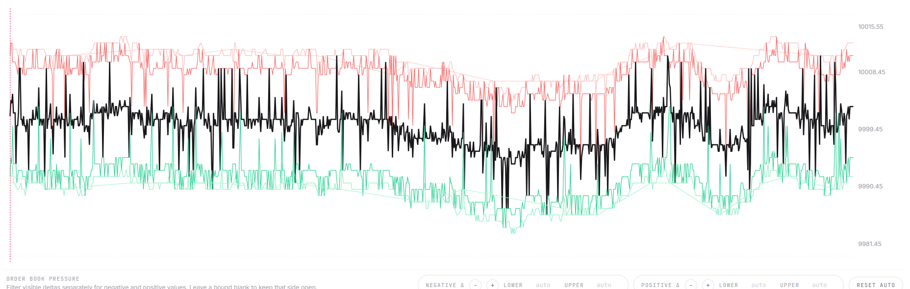
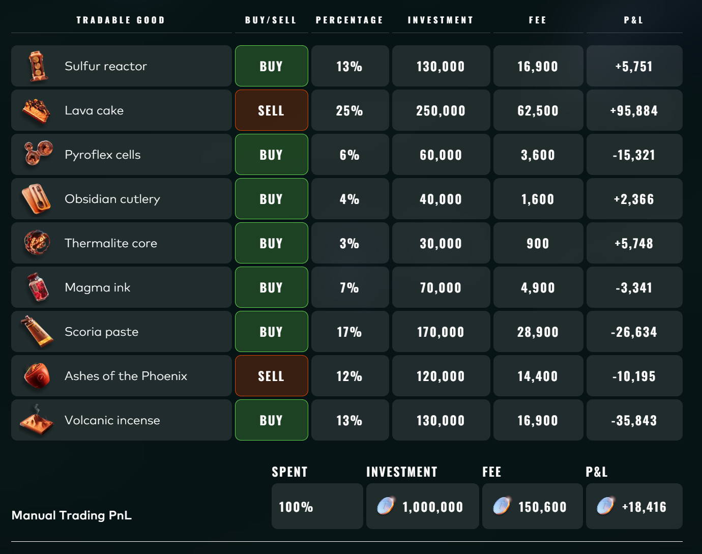
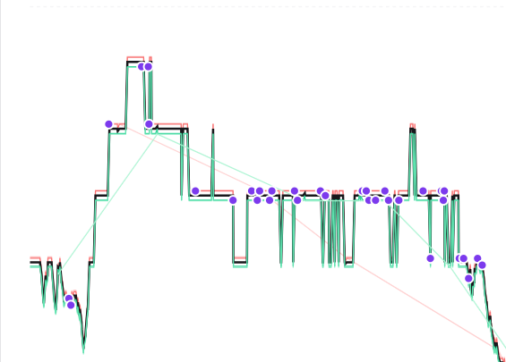

# Round 1 / Round 2: ASH and ROOT

## Product Introduction

### `INTARIAN_PEPPER_ROOT`

`INTARIAN_PEPPER_ROOT` was one of the early algorithmic products. Its price behavior showed a clear upward drift in the historical data we analyzed. This made it very different from products where the best strategy is to trade around a stable fair value.

### `ASH_COATED_OSMIUM`

`ASH_COATED_OSMIUM` had a relatively wide spread and interesting order-book behavior. Instead of treating it as a pure directional product, we mainly approached it as a market-making product.

## `INTARIAN_PEPPER_ROOT`: Drift Following

For `INTARIAN_PEPPER_ROOT`, the price showed a very strong upward drift. Our strategy was simple: buy up to the position limit near the beginning of the session and hold.

The main implementation detail was **slippage**. Buying the full position too aggressively could require sweeping multiple ask levels, so execution still mattered even though the high-level idea was straightforward.


## `ASH_COATED_OSMIUM`: Market Making

For `ASH_COATED_OSMIUM`, the spread was large enough to make market making attractive. Our baseline quotes were placed around the current order book:

```text
buy quote  = best_bid + 1
sell quote = best_ask - 1
```

The goal was to provide liquidity slightly better than the existing best prices, while keeping inventory under control.



## Additional Observation: One-Sided Order Book

The most important additional observation was that in `ASH_COATED_OSMIUM`, one side of the order book would sometimes disappear entirely.

We exploited these moments by posting advantageous quotes, especially high-priced orders when liquidity on one side became temporarily scarce.



The visualizer also helped us inspect how bot trades interacted with the price path.



## What Worked

- The root drift strategy was simple and robust.
- Market making on ash used the naturally wide spread.
- Watching abnormal order-book states gave useful extra opportunities.

## What Could Be Improved

- More careful execution logic for `INTARIAN_PEPPER_ROOT` could reduce slippage.
- Inventory-aware quoting for `ASH_COATED_OSMIUM` could make the strategy safer.
- Some order-book anomalies were temporary, so the strategy needed to avoid overreacting.
