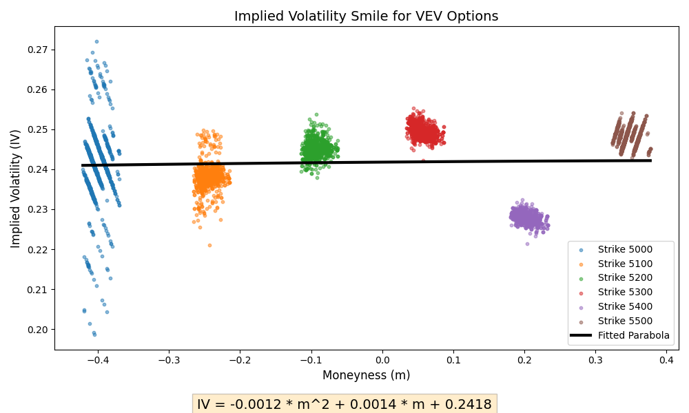
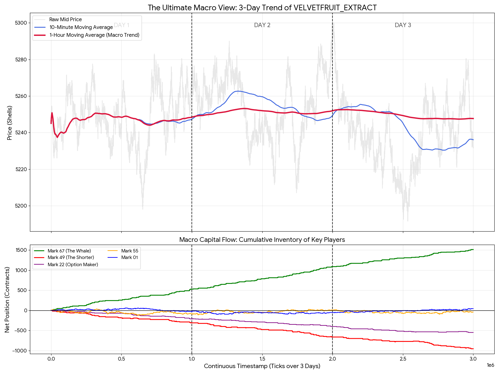

# Round 3 / Round 4: HYDRO, VELVET, and Options

## Product Introduction

### `VELVETFRUIT_EXTRACT`

`VELVETFRUIT_EXTRACT` became one of the most important products in this part of the competition. It had noisy short-term movement, but a longer-horizon mean-reversion structure became useful after we tuned the parameters correctly.

### `HYDROGEL_PACK`

`HYDROGEL_PACK` appeared to have some relationship with `VELVETFRUIT_EXTRACT`. Our main research direction was to test whether one product could help predict the other through correlation or lag analysis.

### VEV Options

This round also introduced options. Our first instinct was to use option pricing ideas, estimate implied volatility through Black-Scholes, and look for patterns such as an implied volatility smile.

## Initial Option Attempt

Since options were introduced, we first tried to calculate implied volatility using Black-Scholes. We hoped to find something like a volatility smile that could suggest mispricing.

However, this did not directly lead to a good strategy. The fitted IV curve was not enough for us to produce stable PnL.

## HYDRO / VELVET Relationship

After observing the data, we formed the hypothesis that `HYDROGEL_PACK` and `VELVETFRUIT_EXTRACT` were related.

We then used code to brute-force reasonable lags and fit possible lead-lag relationships.

## Round 3 Result

In Round 3, we did not have a strong idea for how to use the options. Our option strategy was mostly passive quoting, and the final profit was quite weak.

At the time, we also tried mean reversion on `VELVETFRUIT_EXTRACT`, but it did not work well because the EMA parameters were badly tuned.

## Round 4 Improvement

In Round 4, we realized that most options moved in the same direction as the original `VELVETFRUIT_EXTRACT`. This suggested that we could treat some options as leveraged versions of the underlying product.

Therefore, the key became finding a better `VELVETFRUIT_EXTRACT` strategy.

We eventually found that a slightly longer-horizon mean-reversion strategy worked well. The earlier failure in Round 3 was mostly due to poor EMA parameter tuning. After fixing this, the profit improved significantly.

## Fair Value Cleaning

Another question was how the official PnL curve was generated. After experimentation, we noticed that the observed order book seemed to contain a two-layer market maker structure and other small retail-like orders.

A more accurate fair value estimate should remove or reduce the influence of noisy retail orders before computing the fair value.

This idea helped us tune the mean-reversion strategy further.

## HYDRO Strategy

For `HYDROGEL_PACK`, we did not have as many strong ideas. The final approach was a combination of simple market making and EMA-based mean reversion.

## What Worked

- Treating options as leveraged versions of the underlying was more useful than trying to perfectly model the IV surface.
- Medium-term mean reversion on `VELVETFRUIT_EXTRACT` worked after parameter tuning.
- Cleaning noisy order-book levels improved the fair value estimate.

## What Failed

- The initial Black-Scholes / IV-smile approach did not directly produce a profitable strategy.
- Passive option market making in Round 3 gave weak results.
- EMA mean reversion failed when the parameters were poorly tuned.

## Possible Improvements

- More systematic option valuation and hedging.
- Better lag validation between `HYDROGEL_PACK` and `VELVETFRUIT_EXTRACT`.
- More robust parameter search for EMA windows.
