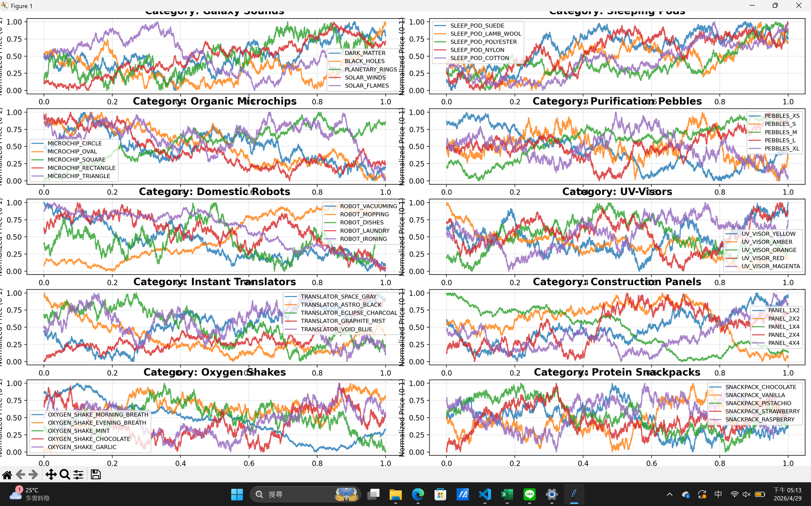
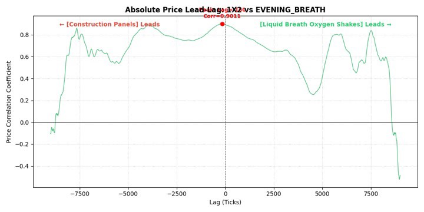

# Round 5: Large Product Universe

## Round Introduction

Round 5 introduced a much larger universe of products. Instead of focusing on only a few products, we had to handle many categories and quickly decide which products were worth deeper analysis.

The product universe included many themed groups, such as galaxy-related goods, sleeping pods, organic microchips, purification pebbles, domestic robots, UV visors, instant translators, construction panels, oxygen shakes, and protein snackpacks.

Because there were too many products to study one by one, our strategy became more systematic and screening-based.

## Screening Plan

Our plan was:

1. Quickly run local backtests to identify products where simple market making was already profitable.
2. Leave those products mostly unchanged.
3. Spend research time on products where simple market making did not work.
4. Search for correlations between products.
5. Test whether lagged relationships could predict short-term movement.
6. Add special-case logic for abnormal price behavior.

## Correlation and Lead-Lag Ideas

We first tried correlation-based simulations and found that some products had high correlation.

At first, if a pair had high correlation, we treated it as likely meaningful. This was not fully rigorous, but it helped us quickly generate candidate strategies under time pressure.

The basic strategy was to buy one side and sell the other when the relative price created an apparent arbitrage opportunity.

We also tested lagged correlations. For some pairs, one product seemed to move before another, so we could use the leading product to predict the lagging product.

## Abnormal Straight-Line Price Behavior

One important observation was that some products had abnormal price behavior: the price would become almost a straight line, and jumps often occurred in increments of around 100.

This kind of behavior was very different from normal noisy market movement, so I designed special code to detect and handle this case.

## What Worked

- Screening products quickly helped us avoid wasting time.
- Simple market making still worked on some products.
- Correlation and lag analysis produced useful candidate ideas.
- Special-case handling for abnormal price movement was valuable.

## What Failed / Risk

- High correlation did not always imply a stable trading relationship.
- Lead-lag relationships were easy to overfit.
- With so many products, it was difficult to validate every parameter carefully.
- Special-case logic could fail if the abnormal behavior disappeared.

## Possible Improvements

- Build a better automated scanner for market-making profitability.
- Use stricter statistical tests for lead-lag relationships.
- Separate stable correlations from temporary correlations.
- Create product dashboards for faster visual analysis.
